☕ Cafe Otomasyonu

Bu proje, C# Windows Forms ve MySQL kullanılarak geliştirilmiş bir Cafe Otomasyon Sistemidir. Sistem; müşteri kayıt ve giriş işlemleri, masa yönetimi, ürün listeleme, sipariş oluşturma, sepet işlemleri, ödeme alma ve yönetici paneli gibi temel cafe yönetim süreçlerini dijital ortamda gerçekleştirmektedir.

🎯 Projenin Amacı

Cafe işletmelerinde sipariş süreçlerini hızlandırmak, masa takibini kolaylaştırmak ve kullanıcıların siparişlerini daha düzenli bir şekilde yönetebilmesini sağlamak amacıyla geliştirilmiştir.

🛠 Kullanılan Teknolojiler
C# (.NET Framework)
Windows Forms
MySQL Veritabanı
Guna UI Framework
SHA256 Şifreleme Algoritması
ADO.NET
✨ Özellikler
👤 Kullanıcı İşlemleri
Kullanıcı kayıt sistemi
Telefon numarası ile giriş yapabilme
SHA256 algoritması ile güvenli şifre saklama
Kullanıcı bilgilerinin veritabanında tutulması
Oturum açma ve çıkış işlemleri
🍽 Masa Yönetimi
Dinamik masa görüntüleme
Masa durumlarını takip edebilme
Boş ve dolu masaların görsel olarak gösterilmesi
Masa seçerek sipariş oluşturabilme
📋 Menü Sistemi
Ürünlerin veritabanından çekilmesi
Kategorilere göre ürün filtreleme
Ürün görsellerinin görüntülenmesi
Ürün detaylarının listelenmesi
🛒 Sepet İşlemleri
Ürün ekleme
Ürün silme
Adet güncelleme
Toplam tutar hesaplama
Sipariş özeti görüntüleme
💳 Ödeme Sistemi
Nakit ödeme seçeneği
Kredi kartı ödeme seçeneği
Sipariş onaylama işlemi
🔐 Yönetici Paneli
Ürün yönetimi
Sipariş yönetimi
Kullanıcı yönetimi
Masa yönetimi
Yönetici giriş ekranı
📂 Veritabanı Yapısı

Projede MySQL veritabanı kullanılmaktadır.

Başlıca tablolar:

Kullanicilar
Urunler
Masalar
Siparisler
SiparisDetaylari
🔒 Güvenlik

Kullanıcı şifreleri veritabanında düz metin olarak tutulmamaktadır. Şifreler SHA256 algoritması kullanılarak hashlenmekte ve güvenli şekilde saklanmaktadır.

# 📸 Uygulama Ekran Görüntüleri

## 🏠 Ana Menü

Uygulamanın başlangıç ekranıdır. Kullanıcılar giriş yapabilir veya yeni hesap oluşturabilir.

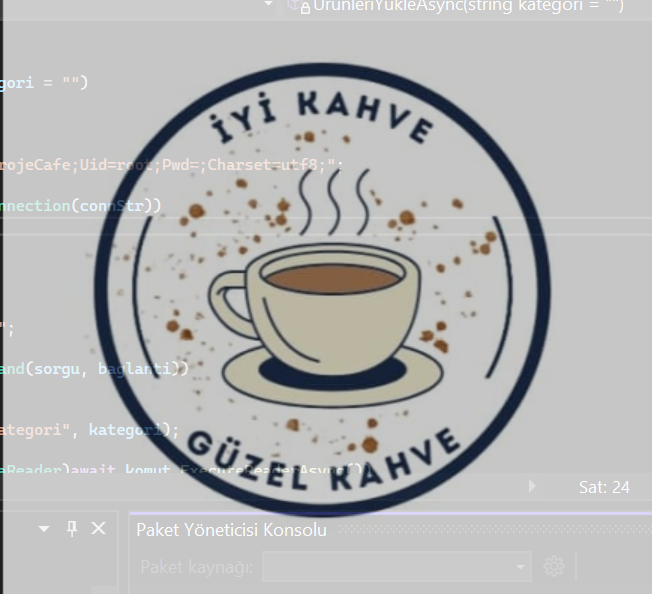

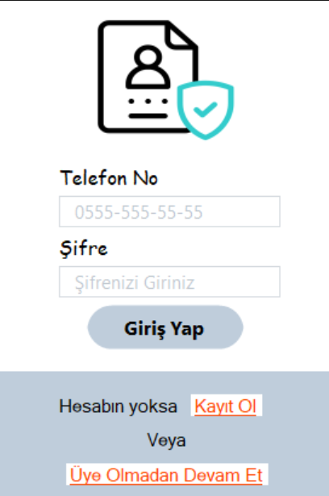

---

## 📝 Kayıt Ol Ekranı

Yeni kullanıcıların sisteme kayıt olmasını sağlayan ekrandır.

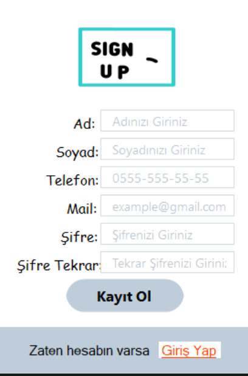

---

# 👤 Kullanıcı Paneli

## 🚪 Masa Seçim Ekranı

Kullanıcıların sipariş verecekleri masayı seçtikleri ekrandır.

---

## 🍽️ Menü Ekranı

Cafe ürünlerinin listelendiği ana menü ekranıdır.

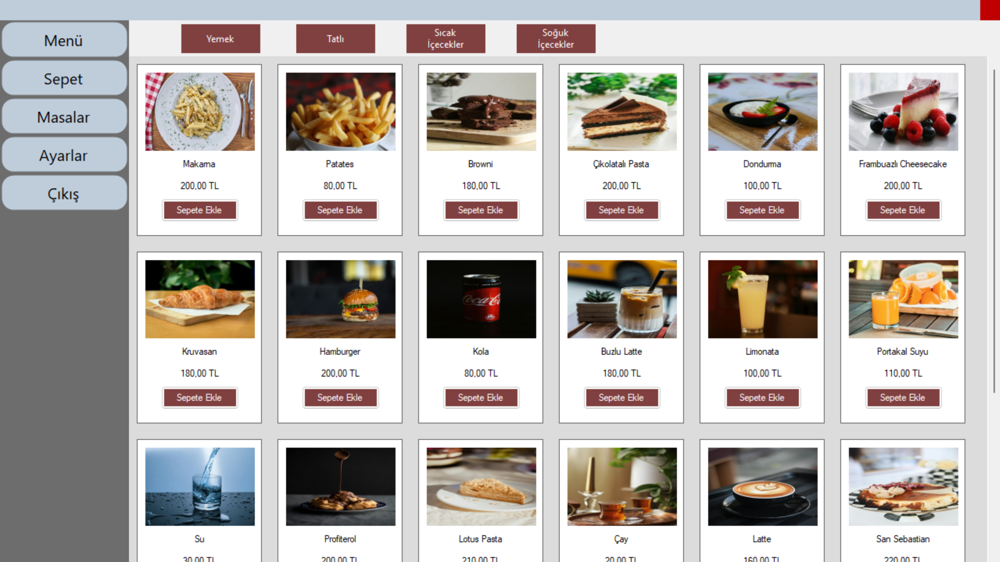

### 🍔 Yemek Menüsü

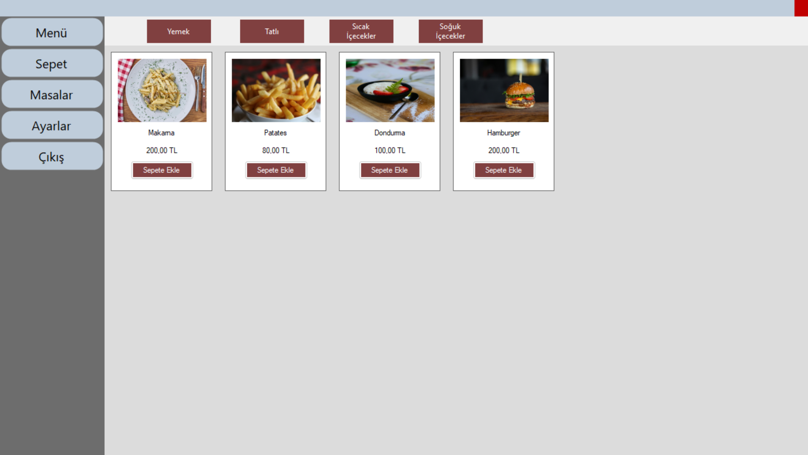

### 🍰 Tatlı Menüsü

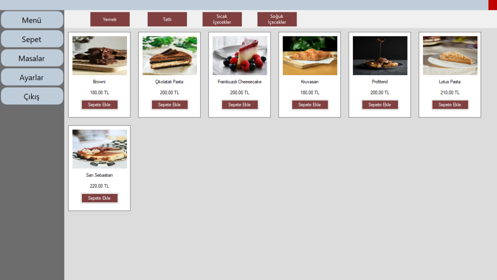

### ☕ Sıcak İçecek Menüsü

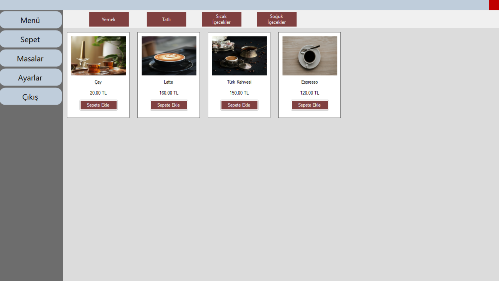

### 🥤 Soğuk İçecek Menüsü

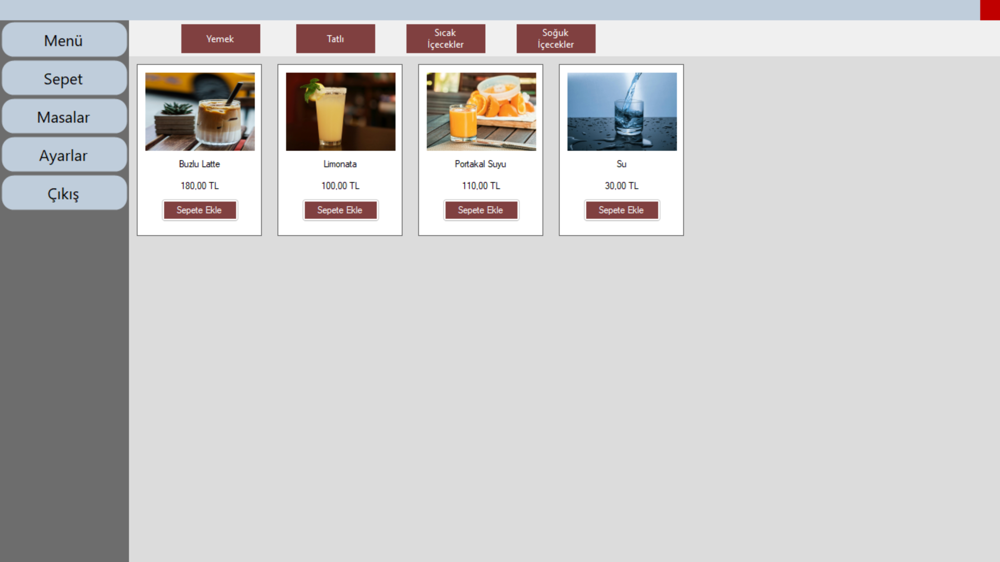

---

## 🛒 Sepet Ekranı

Kullanıcının seçtiği ürünleri görüntülediği ve sipariş oluşturduğu ekrandır.

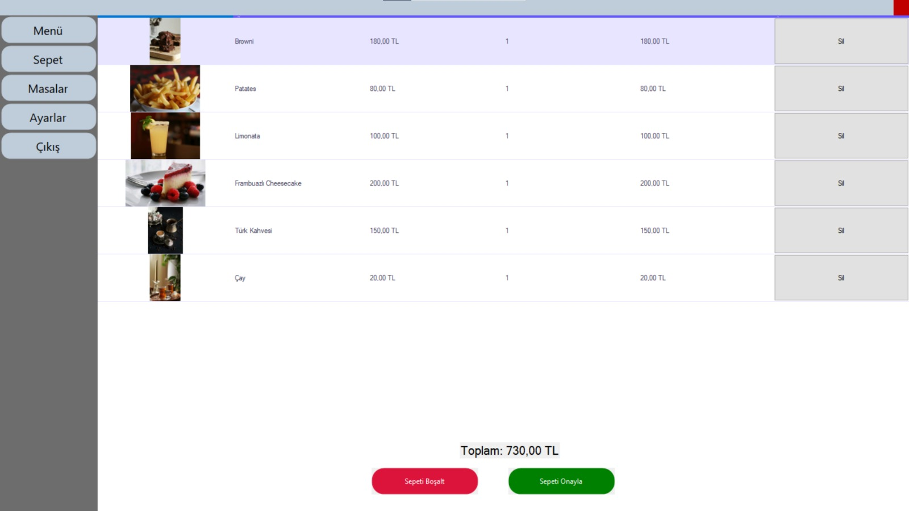

---

## ⚙️ Kullanıcı Ayarları

Kullanıcı bilgilerinin görüntülendiği ve düzenlenebildiği ekrandır.

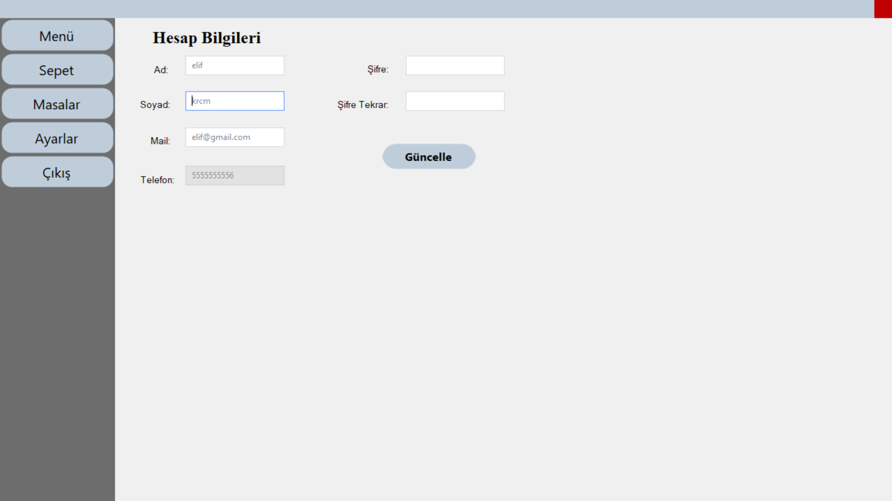

---

# 🔐 Yönetici Paneli

## 📦 Ürün Yönetimi

Ürün ekleme, silme ve güncelleme işlemlerinin yapıldığı ekran.

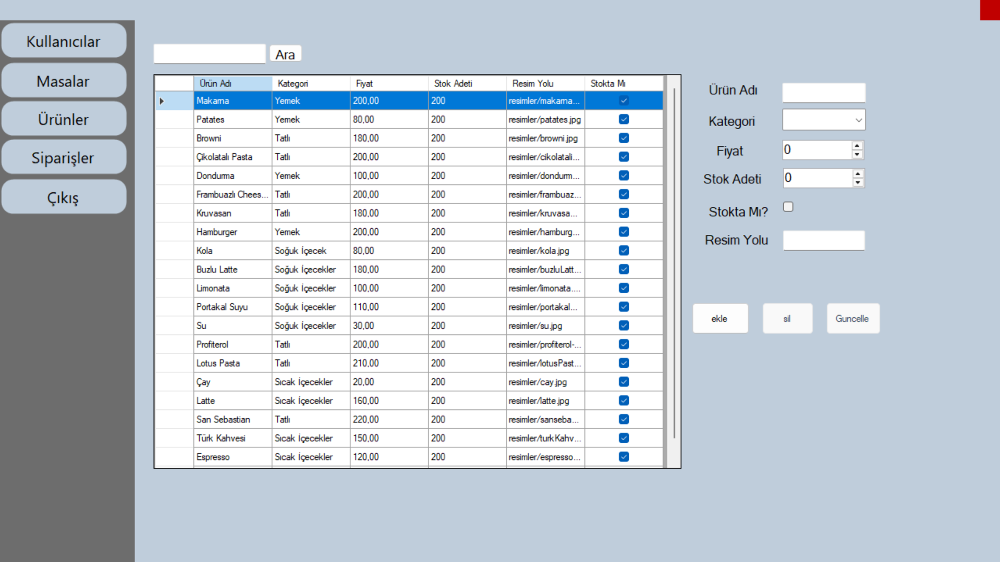

---

## 📋 Sipariş Yönetimi

Müşteri siparişlerinin görüntülendiği ve yönetildiği ekran.

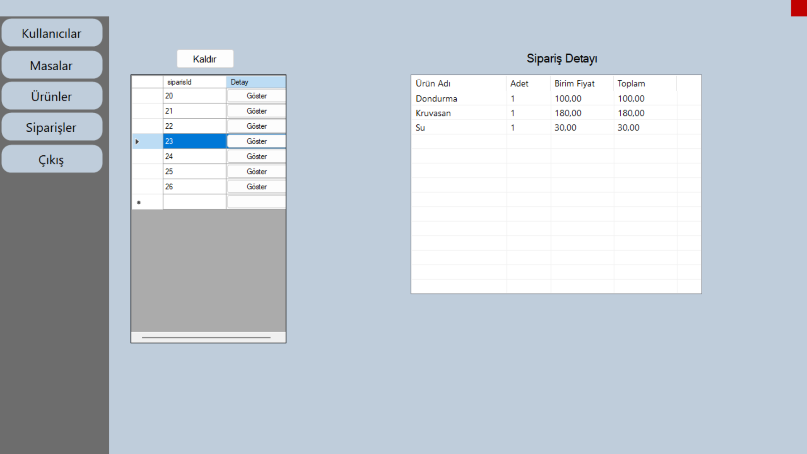

---

## 🪑 Masa Yönetimi

Masaların durumlarının takip edildiği ve yönetildiği ekran.

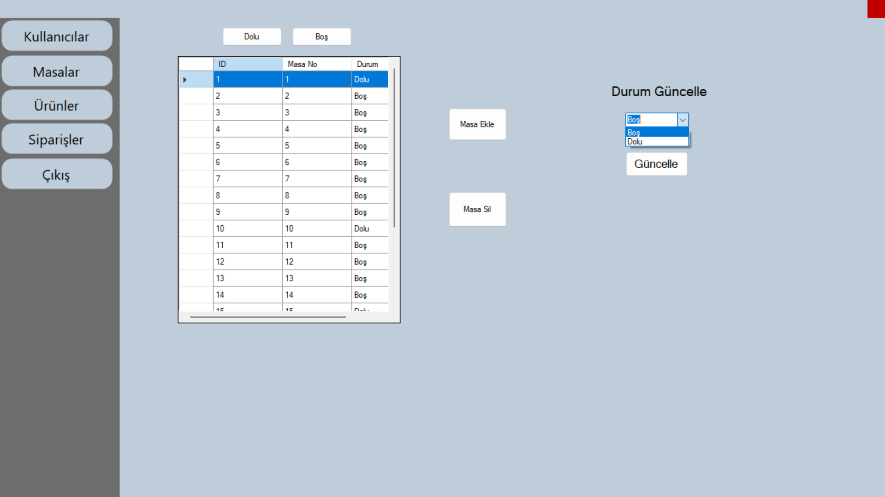

---

## 👥 Kullanıcı Yönetimi

Sistemde kayıtlı kullanıcıların görüntülendiği ve yönetildiği ekran.

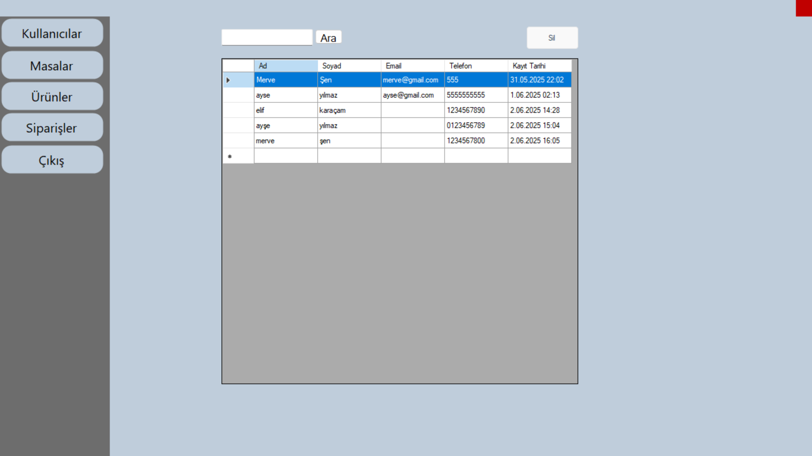

👥 Proje Ekibi
Elif Karaçam
Ayşe Yılmaz
Merve Nur Şen
